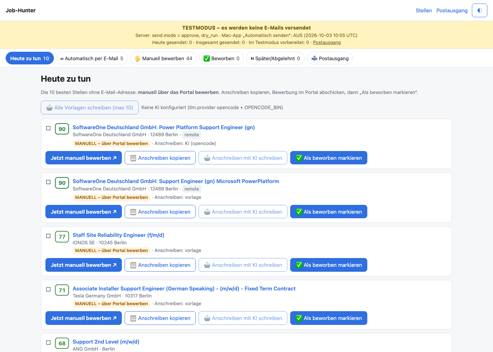
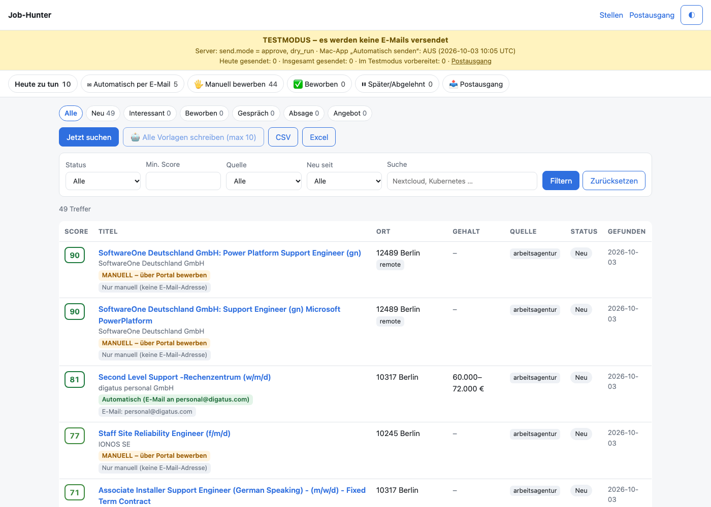
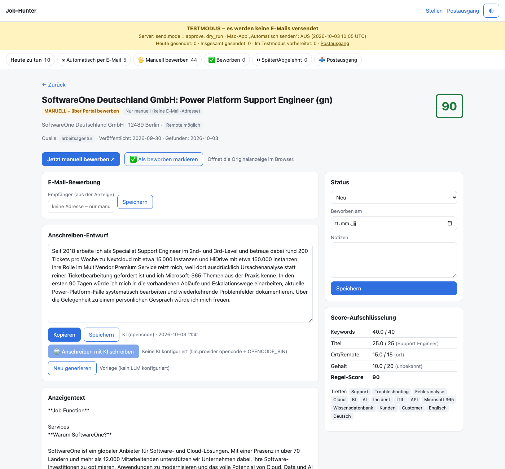
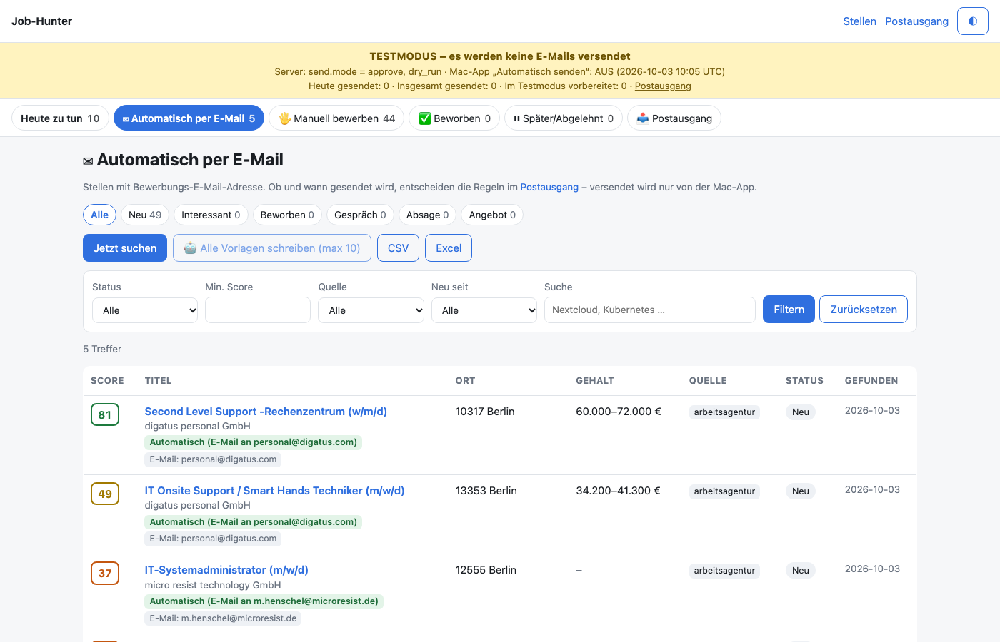
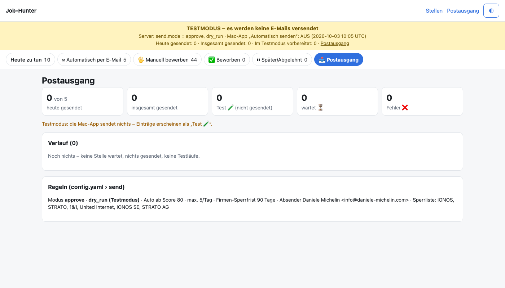
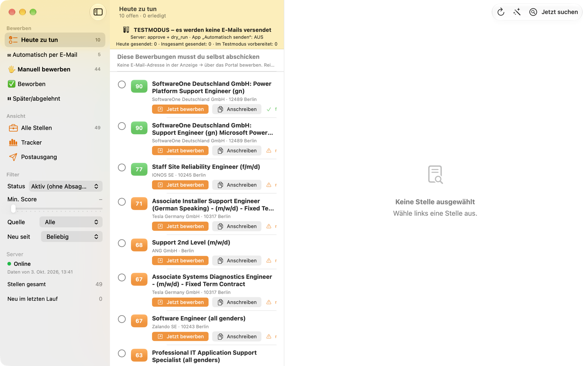

# Job-Hunter

**English** · [Deutsch](README.de.md) · [Italiano (technical details)](docs/README.it.md)

A self-hosted job-search assistant for the German job market. Every morning it finds new postings, scores them against your profile, writes a short German cover letter with AI (opencode), and shows everything in a web dashboard and a native macOS app — with a clear split between applications that go out **automatically by e-mail** and those you do **by hand** on a company portal.

> **Your data stays on your own machines.** Profile, database, passwords and the AI tool (opencode) live on your Mac and your own server. This repository contains no private data: your real profile (`data/cv_profile.md`), `.env` with passwords and the database are git-ignored. Defaults such as the sender address in `config.yaml` are meant to be changed.

---

## Screenshots

| Today's manual applications | All jobs with auto/manual labels |
|---|---|
|  |  |
| **Job detail: AI letter, score breakdown** | **Automatic (e-mail) view** |
|  |  |
| **Postausgang (sent / test / waiting / error)** | **macOS app** |
|  |  |

---

## How it works

```
 Arbeitsagentur API · Adzuna · RSS          (public sources, no logins)
                │  daily 06:30
                ▼
 ┌────────────────────────────────┐        ┌──────────────────────────────┐
 │  Server (Docker, FastAPI)      │  API   │  macOS app "JobHunter"       │
 │  • dedup + score 0–100         │◄──────►│  • same views, works offline │
 │  • cover letters (opencode)    │        │  • writes letters (opencode) │
 │  • web dashboard + tracker     │        │  • sends e-mail via Apple    │
 │  • send rules (single source)  │        │    Mail (only if server OK)  │
 └────────────────────────────────┘        └──────────────────────────────┘
```

1. **Find** – the server queries public job APIs (Bundesagentur für Arbeit, optionally Adzuna and RSS feeds) and removes duplicates.
2. **Score** – each posting gets 0–100 points: keywords from your profile, job title, location/remote, salary vs. your minimum. Excluded titles (Junior, Werkstudent, …) get 0.
3. **Write** – for good matches, opencode writes a 3–4 paragraph German letter in first person, using only facts from your profile and the posting. Letters with placeholders, invented numbers or the wrong perspective are rejected.
4. **Sort** – every job lands in one view:
   - **✉ Automatisch per E-Mail** – the posting contains an application e-mail address
   - **🖐 Manuell bewerben** – apply on the company portal (button opens it and copies the letter)
   - **Heute zu tun** – today's top 10 manual applications
   - **✅ Beworben** / **⏸ Später/Abgelehnt**
5. **Send** – the macOS app sends e-mail applications through Apple Mail with your CV attached, strictly following the server's rules (see below). Everything is logged in **Postausgang** (Sent ✅ / Test 🧪 / Waiting ⏳ / Error ❌).
6. **Track** – statuses `neu → interessant → beworben → Gespräch → Absage/Angebot`, notes, applied date, CSV/XLSX export.

### Safety rules for automatic sending
- Starts in **test mode** (`dry_run: true`) – nothing is sent until you switch it off.
- Max **5 per day**, minimum score **80**, never the same company twice within **90 days**.
- Blocklist (e.g. your current employer), never template letters, never while offline.
- Kill switch in `config.yaml` and an "Automatisch senden" toggle in the app.
- **No bots on job boards** (StepStone, Indeed, LinkedIn forbid it) and no form-filling on portals – those stay manual.

### Job alerts from LinkedIn, StepStone, Indeed (no bots)
Job boards forbid scraping, so the macOS app reads the **job-alert e-mails you already receive** in Apple Mail (read-only, no password) and imports title, company, location and link (`POST /api/v1/jobs/import`, deduplicated against existing jobs). These jobs are always **manual**. Alerts carry no posting text: paste it with **„Anzeigentext einfügen“** – the job is re-scored and the AI writes the letter. Settings → **Job-Alerts** (account, days, „Jetzt importieren“). StepStone alerts are parsed from real mails (incl. the full posting text, so the AI can write the letter right away); the Indeed parser is not yet tested with real alerts.

### Cover letter as PDF
Every letter can be exported as a one-page A4 German business letter (sender, recipient, date, subject, salutation, body, closing, „Anlage: Lebenslauf“) in the CV style: dashboard `/jobs/{id}/anschreiben` (print page) and `/jobs/{id}/anschreiben.pdf`, Mac app **„Als PDF speichern“** → `~/Bewerbung/Anschreiben/`. Sender details: `applicant:` in `config.yaml`.

### Letter quality guards
3–4 paragraphs (180–260 words), first person, only facts from profile + posting, no placeholders, no invented numbers, no English filler words. Failed generations are retried (`llm.retries`, optional `llm.fallback_model`). **Template letters are never e-mailed** – only AI or user-edited letters. CLI: `python -m jobhunter letters [--all] [--ids 18] [--dry-run]`.

---

## Repository layout

| Path | What |
|---|---|
| `jobhunter/` | Server (Python 3.12, FastAPI, SQLite) |
| `config.yaml` | **Search profile & rules** – the main place to customise |
| `data/cv_profile.example.md` | Template for your profile → copy to `data/cv_profile.md` |
| `.env.example` | Secrets & overrides template → copy to `.env` |
| `macos/` | Native SwiftUI app (macOS 15+) |
| `tests/` | pytest suite |
| `docs/README.it.md` | Full technical reference (API, deploy, internals) |

---

## Quick start

### Server (Linux, Docker)
```bash
git clone <this repo> /opt/job-hunter && cd /opt/job-hunter
cp .env.example .env && nano .env                 # DASHBOARD_USER / DASHBOARD_PASSWORD
cp data/cv_profile.example.md data/cv_profile.md && nano data/cv_profile.md
sudo chown -R 1000:1000 data
docker compose up -d --build
docker compose exec jobhunter python -m jobhunter run   # first search now
```
Dashboard on `http://127.0.0.1:8000` (put nginx/Caddy with HTTPS in front; sub-folder via `BASE_PATH=/jobs`).

### Locally on a Mac (without Docker)
```bash
python3.12 -m venv .venv && .venv/bin/pip install -r requirements-dev.txt
cp data/cv_profile.example.md data/cv_profile.md
DASHBOARD_USER=me DASHBOARD_PASSWORD=secret .venv/bin/python -m jobhunter serve --port 8000
```

### macOS app
```bash
cd macos && scripts/build-app.sh --install     # → ~/Applications/JobHunter.app
```
Then **⌘ ,** → server URL, user, password (stored in the Keychain).

---

## Customising

### 1. What to search – `config.yaml` → `search:`
| Key | Meaning |
|---|---|
| `queries` | search terms sent to the job APIs |
| `location`, `radius_km`, `remote_ok` | where |
| `days_back` | only postings from the last N days |
| `min_salary` | EUR/year; unknown salary counts as neutral |
| `target_titles` | titles that earn full title points |
| `excluded_title_keywords` | title contains → score 0 (e.g. Junior, Praktikum) |
| `excluded_keywords` | in text −10 each; in title → 0 |
| `keyword_weights` | extra/override weights for keywords |

After changes: `docker compose restart jobhunter` and `docker compose exec jobhunter python -m jobhunter rescore`.

### 2. Who you are – `data/cv_profile.md`
- `## Kernergebnisse` – concrete, true results; the AI uses them for the first sentence. **Only real facts** – the AI may only use numbers that appear here or in the posting.
- `## Keywords` – `Keyword: weight` pairs that drive the score.
- Experience, skills, education, languages – context for the AI.

### 3. AI letters – opencode
| Setting | Where |
|---|---|
| Provider/model on the server | `.env`: `LLM_PROVIDER=opencode`, `LLM_MODEL=opencode/big-pickle`, build with `INSTALL_OPENCODE=1` |
| Model in the Mac app | Settings → **KI-Anschreiben** (list from `opencode models`, incl. local Ollama) |
| Other providers | `anthropic` (API key) or any OpenAI-compatible endpoint (IONOS AI, Ollama – small models only) |
| Letter rules | `LETTER_RULES` in `jobhunter/llm.py` and `macos/Sources/JobHunterCore/LetterWriter.swift` (keep both in sync) |
| Limits | `llm.threshold` (min. score), `llm.max_per_run`, `llm.timeout_s` |

Without any AI the app still works and creates a template letter with `[...]` gaps (never sent automatically).

### 4. Sending – `config.yaml` → `send:`
| Key | Default | Meaning |
|---|---|---|
| `mode` | `approve` | `off` · `approve` (per job) · `auto` |
| `dry_run` | `true` | test mode – nothing leaves your Mac |
| `daily_cap` | `5` | max real sends per day |
| `auto_min_score` | `80` | auto only above this score |
| `company_cooldown_days` | `90` | per company |
| `blocklist` | – | companies never contacted |
| `kill_switch` | `false` | stop everything immediately |
| `from_address`, `sender_name`, `subject_template` | – | e-mail details |

In the app: Settings → **E-Mail-Versand** → CV PDF, "Mail-Konto prüfen", **Automatisch senden** toggle.

### 5. Sources, schedule, notifications
- `sources:` enable/disable Arbeitsagentur, Adzuna (`ADZUNA_APP_ID/KEY` in `.env`), RSS feeds.
- `schedule.cron` – default `30 6 * * *` (Europe/Berlin).
- Telegram: `TELEGRAM_BOT_TOKEN`, `TELEGRAM_CHAT_ID` in `.env`.
- UI language: `ui_lang: de | it`.

---

## Development
```bash
.venv/bin/python -m pytest                                   # server tests
cd macos && swift test                                       # app tests
```
See [docs/README.it.md](docs/README.it.md) for the API reference (`/api/v1`) and deployment details, and [macos/README.md](macos/README.md) for the app.
